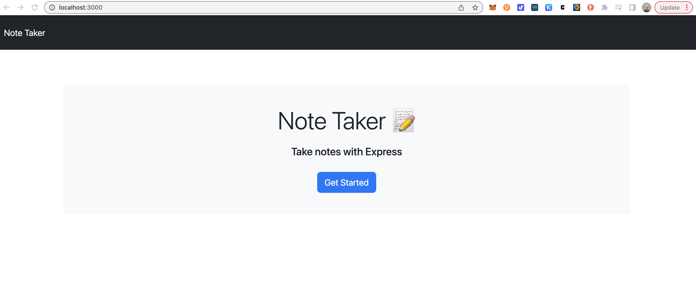

# note-taker

Application to write and save notes

Application uses an Express.js back end and will save and retrieve note data from a JSON file.

starter code has been cloned.

npm uuid was installed to create unique ids for the notes. Routes, server.js and db have all been set up, but I'm getting errors when I run on local host.

Here is a screenshot of what I have rendering on localhost:

